# Active Directory Help Desk Lab

## Overview

This lab simulates common Help Desk and Junior System Administrator tasks performed in an enterprise Active Directory environment.

The objective was to gain hands-on experience managing user accounts, security groups, account lifecycle operations, PowerShell automation, and Active Directory reporting.

---

## Environment

### Infrastructure

| System | Role |
|----------|----------|
| DC01 | Domain Controller |
| CLIENT01 | Domain Joined Workstation |
| Domain | lab.local |

### Technologies

- Windows Server 2022
- Active Directory Domain Services (AD DS)
- PowerShell
- Windows 11
- Oracle VirtualBox

---

# Lab Objectives

- Create new user accounts
- Manage group memberships
- Reset user passwords
- Unlock locked accounts
- Disable and enable accounts
- Transfer users between departments
- Search Active Directory accounts
- Perform bulk user creation
- Generate Active Directory reports

---

# Task 1: User Provisioning

Created new user accounts within the IT Organizational Unit.

### Skills Demonstrated

- User Creation
- Organizational Unit Management
- Account Provisioning

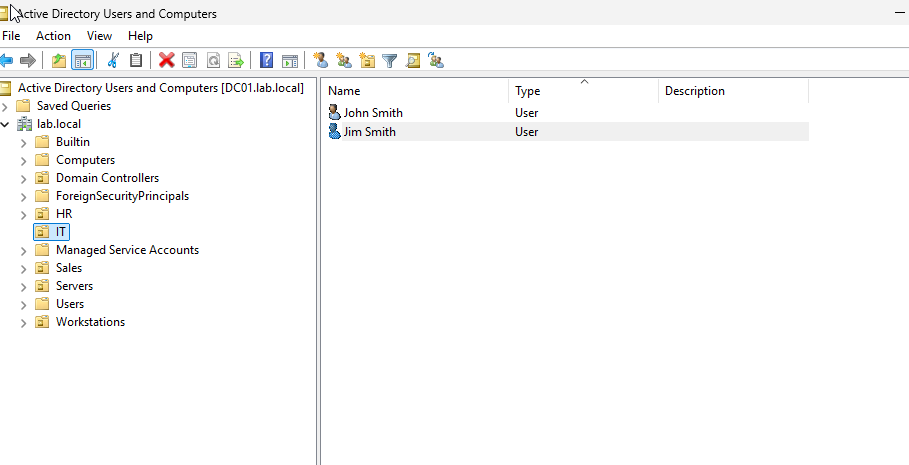

---

# Task 2: Security Group Management

Added users to departmental security groups to grant access to shared resources.

### Skills Demonstrated

- Group Membership Management
- Access Control
- Role-Based Access

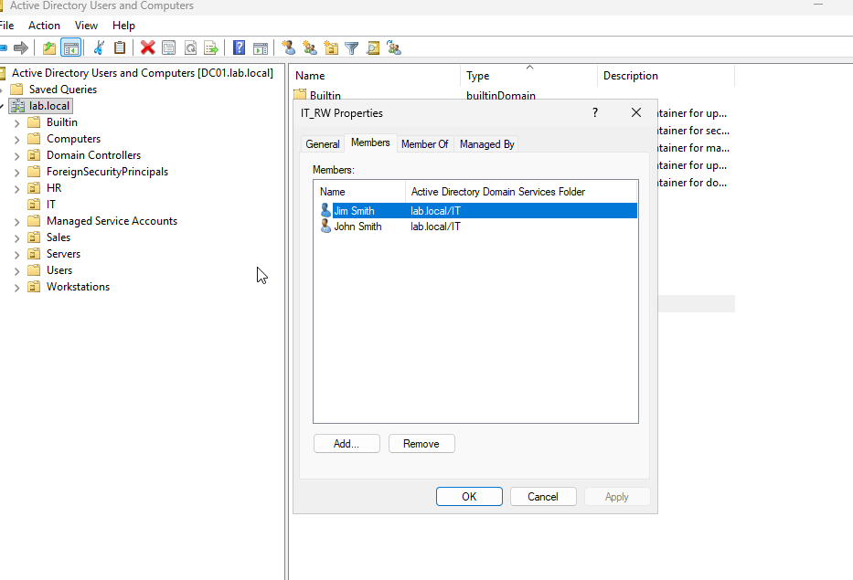

---

# Task 3: Password Reset

Simulated a Help Desk password reset request.

### Skills Demonstrated

- Credential Management
- User Support
- Account Administration

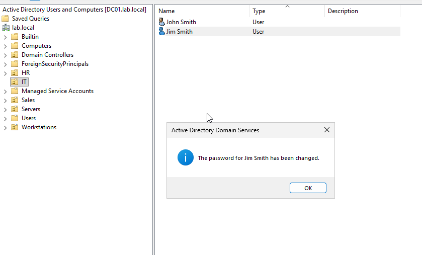

---

# Task 4: Account Unlock

Unlocked a user account after multiple failed login attempts.

### Skills Demonstrated

- Account Recovery
- Help Desk Support
- Authentication Troubleshooting

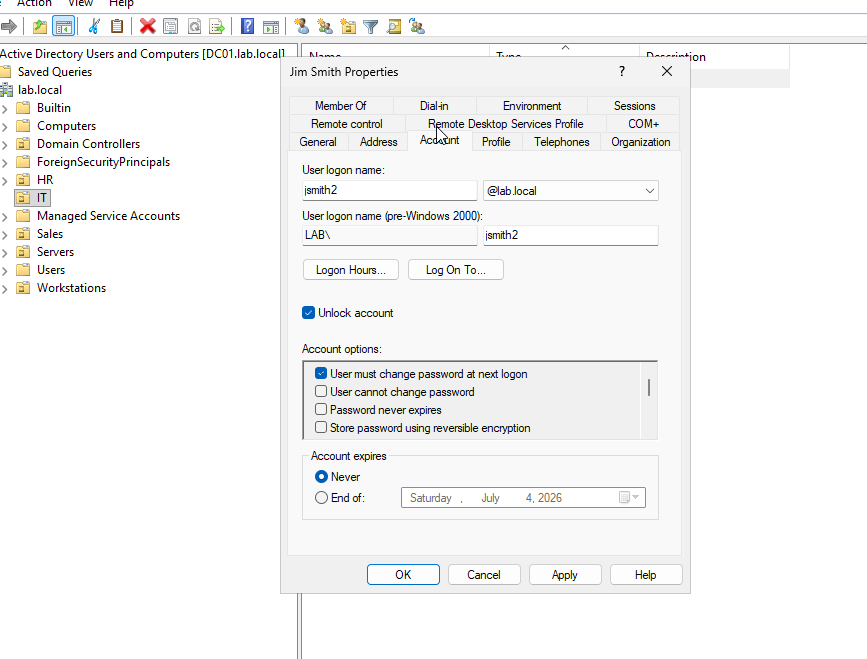

---

# Task 5: Disable User Account

Simulated employee termination by disabling a user account.

### Skills Demonstrated

- Account Lifecycle Management
- Security Administration

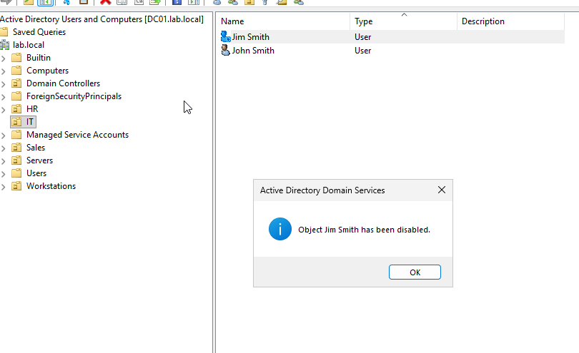

---

# Task 6: Re-Enable User Account

Restored user access by re-enabling the account.

### Skills Demonstrated

- User Account Recovery
- Active Directory Administration

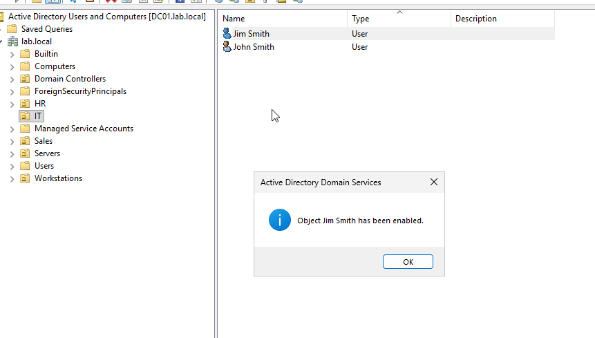

---

# Task 7: Department Transfer

Moved a user from the IT department to the HR department and updated permissions accordingly.

### Skills Demonstrated

- Organizational Unit Management
- Group Membership Updates
- Access Review

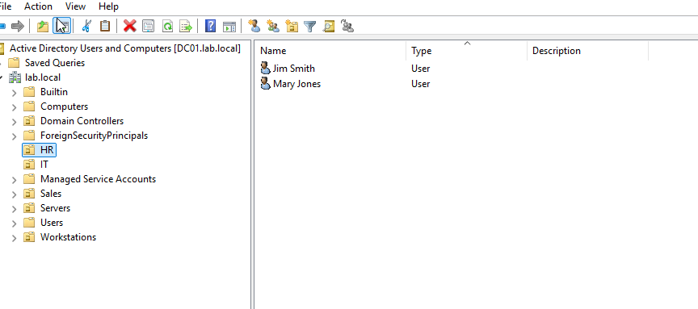

---

# Task 8: Search Disabled Accounts

Used PowerShell to identify disabled accounts within Active Directory.

### Command

```powershell
Search-ADAccount -AccountDisabled -UsersOnly
```

### Skills Demonstrated

- PowerShell
- Active Directory Reporting
- Account Auditing

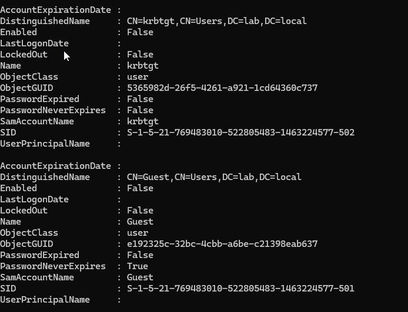

---

# Task 9: Search Inactive Accounts

Identified inactive user accounts using PowerShell.

### Command

```powershell
Search-ADAccount -AccountInactive -UsersOnly -TimeSpan 30.00:00:00
```

### Skills Demonstrated

- PowerShell Automation
- Security Auditing
- User Lifecycle Monitoring

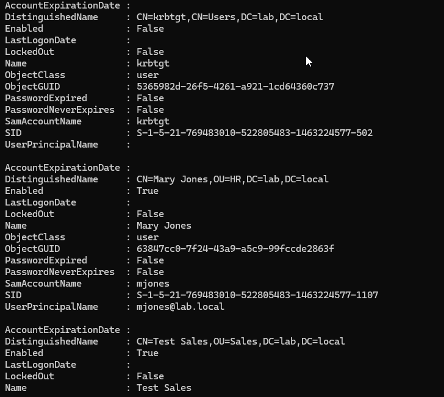

---

# Task 10: Bulk User Creation

Created multiple Active Directory users from a CSV file using PowerShell.

### CSV Example

```csv
FirstName,LastName,Department,Username
Alice,Johnson,IT,ajohnson
Bob,Williams,HR,bwilliams
Tom,Davis,Sales,tdavis
```

### PowerShell Command

```powershell
Import-Csv C:\users.csv | ForEach-Object {
    New-ADUser `
        -Name "$($_.FirstName) $($_.LastName)" `
        -GivenName $_.FirstName `
        -Surname $_.LastName `
        -SamAccountName $_.Username `
        -UserPrincipalName "$($_.Username)@lab.local" `
        -AccountPassword (ConvertTo-SecureString "Password123!" -AsPlainText -Force) `
        -Enabled $true
}
```

### Skills Demonstrated

- PowerShell Automation
- Bulk Provisioning
- Active Directory Management

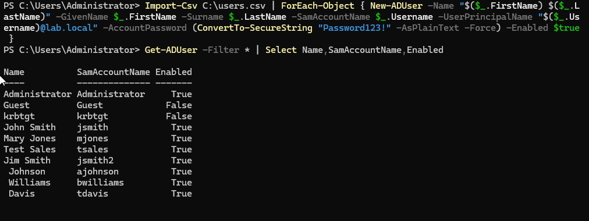

---

# Task 11: Active Directory Reporting

Generated user reports using PowerShell and exported results to CSV.

### Command

```powershell
Get-ADUser -Filter * |
Select Name,SamAccountName,Enabled |
Export-Csv C:\ADUsers.csv -NoTypeInformation
```

### Skills Demonstrated

- Reporting
- PowerShell Scripting
- Audit Support

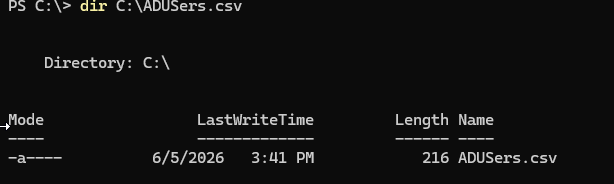

---

# Troubleshooting

## Bulk User Creation Errors

### Issue

PowerShell returned errors during CSV import.

### Root Cause

- Incorrect cmdlet syntax
- Missing dash in New-ADUser
- Typographical errors in parameter values

### Resolution

Corrected PowerShell syntax and verified Active Directory module functionality.

---

## Account Lockout Testing

### Issue

Locked account searches initially returned no results.

### Root Cause

No user accounts were currently locked.

### Resolution

Simulated failed logins and re-ran account lockout searches.

---

# Skills Demonstrated

## Active Directory

- User Management
- Group Management
- Account Lifecycle Administration
- Organizational Unit Management

## PowerShell

- Active Directory Cmdlets
- User Reporting
- Bulk User Creation
- Automation

## Help Desk Operations

- Password Resets
- Account Unlocks
- User Provisioning
- Access Management

## Security

- Access Control
- Identity Management
- User Auditing
- Account Reviews

---

# Lessons Learned

- PowerShell significantly reduces administrative effort.
- Active Directory group management is critical for access control.
- User lifecycle management is a key Help Desk responsibility.
- Reporting and auditing support security and compliance efforts.

---

# Author

Brandon Cooper

Windows Server | Active Directory | Help Desk | System Administration | Cybersecurity
